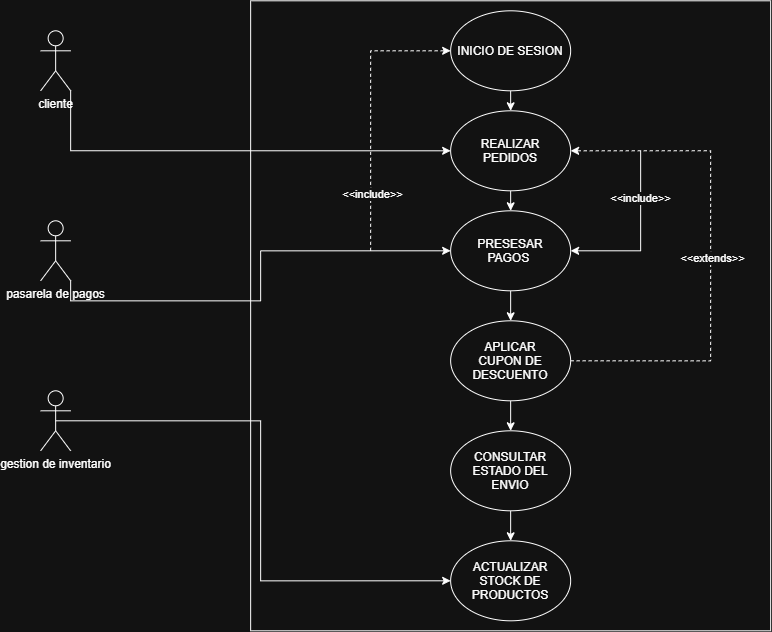

 # Documentación de Arquitectura: Casos de Uso[cite: 1]

## 1. Descripción del Módulo[cite: 1]
El presente documento define los requisitos funcionales del **Sistema de Gestión Hospitalaria**[cite: 1]. Se detalla la interacción entre los actores (Paciente, Médico, Administrador) y las funcionalidades del sistema[cite: 1].

## 2. Diagrama UML de Casos de Uso[cite: 1]
[cite: 1]

## 3. Especificación de Relaciones[cite: 1]
* **Relaciones <<include>>:** *Reservar Cita* y *Generar Factura* requieren obligatoriamente la autenticación previa del usuario en el sistema[cite: 1].
* **Relaciones <<extend>>:** *Aplicar Descuento de Seguro* se ejecuta únicamente si la factura generada cuenta con cobertura médica[cite: 1].
  